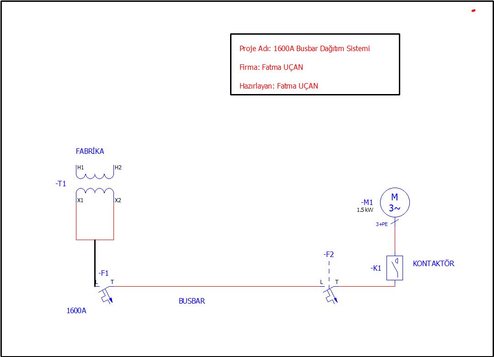

# 🔌 Single Line Busbar – EPLAN Projesi

Bu proje, EPLAN platformu üzerinde oluşturulmuş **tek hatlı bara (single line busbar)** çizim örneğidir. Elektrik panoları ve güç dağıtım sistemlerinde, enerji akışını sade ve anlaşılır bir şekilde göstermek için kullanılan bu gösterim, özellikle orta ve alçak gerilim sistemlerinde tercih edilir.

## 🎯 Projenin Amacı

- Elektrik sistemlerinde **tek hat (single line)** gösterim mantığını uygulamalı olarak göstermek  
- Baralı sistemlerin sadeleştirilmiş sembollerle sunumunu sağlamak  
- Otomasyon, pano tasarımı ve enerji dağıtımı ile ilgilenen mühendisler için bir referans oluşturmak

## 📌 Kullanım Alanları

- Elektrik pano tasarımı
- Orta gerilim sistem diyagramları
- AG (alçak gerilim) dağıtım sistemleri
- EPLAN eğitimi ve referans çalışmaları

## 🛠️ Proje İçeriği

- Single Line Busbar çizimi (EPLAN ile hazırlanmıştır)
- Temel semboller ve bağlantı elemanları
- PDF çıktı ve görsel olarak temsil

## 📷 Örnek Teknik Çizim

Aşağıda, bu projede yer alan örnek bir teknik çizimin görseli yer almaktadır:

